# Отчет по исследованию

## 1. Данные и подготовка
### Источник
- L2-ордербук: `data/BTC-USDT-L2orderbook-400lv-2025-08-28.parquet`

### Преобразование
- Состояния стакана реконструируются и сохраняются в `data/orderbook_data.npy`.
- Формат массива: `(N, 2, 400, 2)` где `side ∈ {bid, ask}`, `level ∈ [0, 399]`, `feature ∈ {price, amount}`.

### Скрипт
- `experiments/volumes/00_data_prep_orderbook/reconstruct.py`

## 2. Эксперименты по объемам
### 2.1 Базовый VAE на полном стакане
- Скрипты: `experiments/volumes/01_full_orderbook_baseline/train.py`, `experiment.py`, `visualize_comparison.py`
- Графики:
  - `experiments/volumes/01_full_orderbook_baseline/plots/training_curves.png`
  - `experiments/volumes/01_full_orderbook_baseline/plots/reconstructions.png`
  - `experiments/volumes/01_full_orderbook_baseline/plots/latent_dim_comparison.png`
  - `experiments/volumes/01_full_orderbook_baseline/plots/comparison_grid.png`

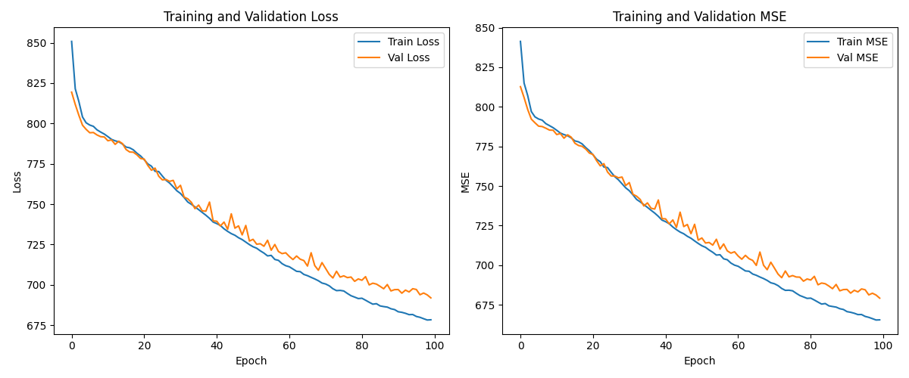
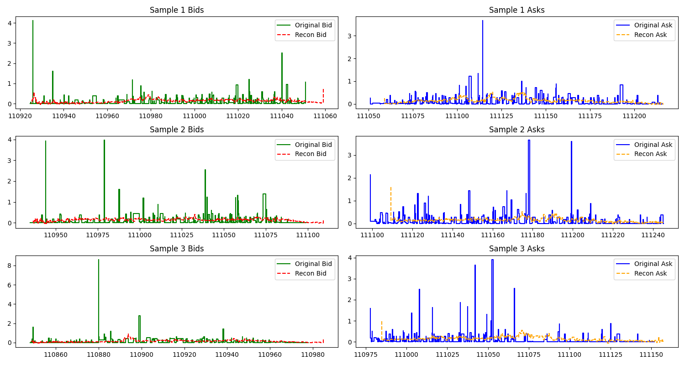

### 2.2 Лог-кумулятивные объемы и детрендинг
- Скрипты: `experiments/volumes/02_log_cumsum_vae/train_volume.py`, `visualize_volume_expanded.py`
- Графики:
  - `experiments/volumes/02_log_cumsum_vae/plots/volume_vae_reconstructions.png`
  - `experiments/volumes/02_log_cumsum_vae/plots/volume_vae_reconstructions_expanded.png`

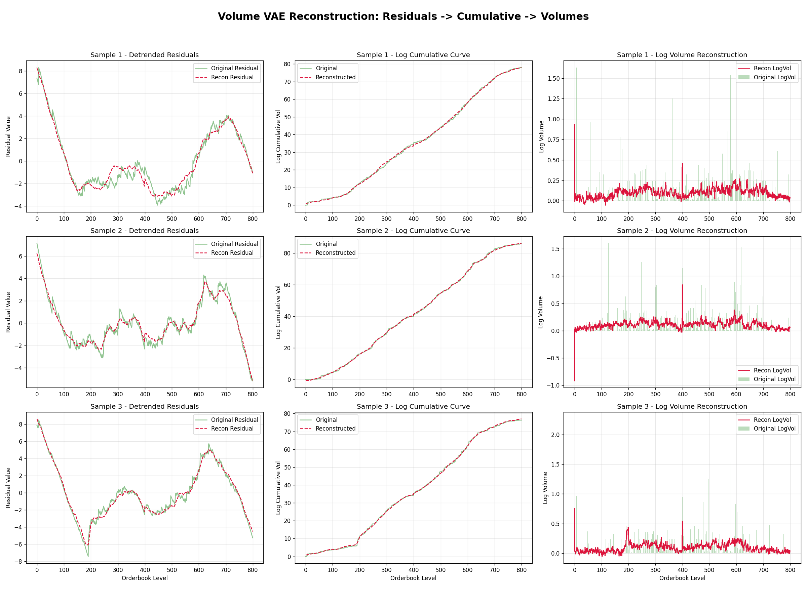

### 2.3 Производная в функции потерь
- Скрипт: `experiments/volumes/03_log_cumsum_derivative_loss/train_volume_derivative.py`
- Артефакты: `experiments/volumes/03_log_cumsum_derivative_loss/models/`

### 2.4 Conv1D и сложные Conv1D
- Скрипты: `experiments/volumes/04_conv1d_vae/train_volume_conv.py`, `experiments/volumes/05_conv1d_complex/train_volume_conv_complex.py`
- Артефакты: `models/` внутри соответствующих папок

### 2.5 Автоэнкодер и гибриды
- AE: `experiments/volumes/06_autoencoder/train_volume_ae.py`
- Hybrid simple: `experiments/volumes/07_hybrid/train_volume_hybrid.py`
- Hybrid complex: `experiments/volumes/08_hybrid_complex/train_volume_hybrid_complex.py`

### 2.6 Мета-ансамбль
- Подготовка ансамбля: `experiments/volumes/09_meta_ensemble/prepare_ensemble_data.py`
- Обучение: `experiments/volumes/09_meta_ensemble/train_meta_model.py`
- Визуализация: `experiments/volumes/09_meta_ensemble/visualize_meta_results.py`

### 2.7 Fidelity-сравнения и расширенные визуализации
- Сравнения: `experiments/volumes/10_fidelity_comparisons/`
- Расширенные визуализации: `experiments/volumes/11_advanced_visualizations/`

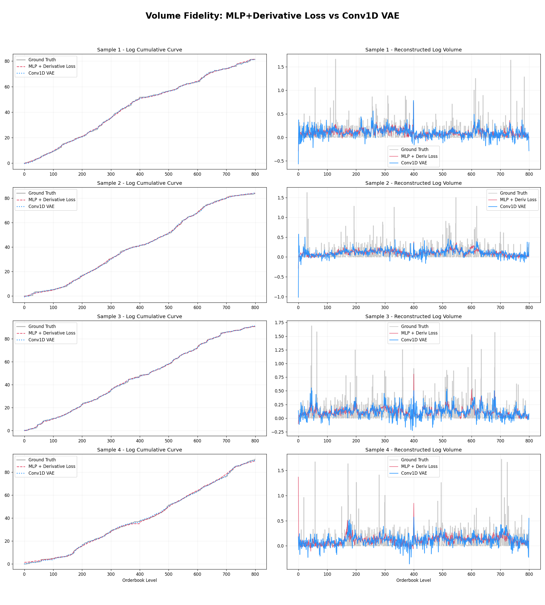
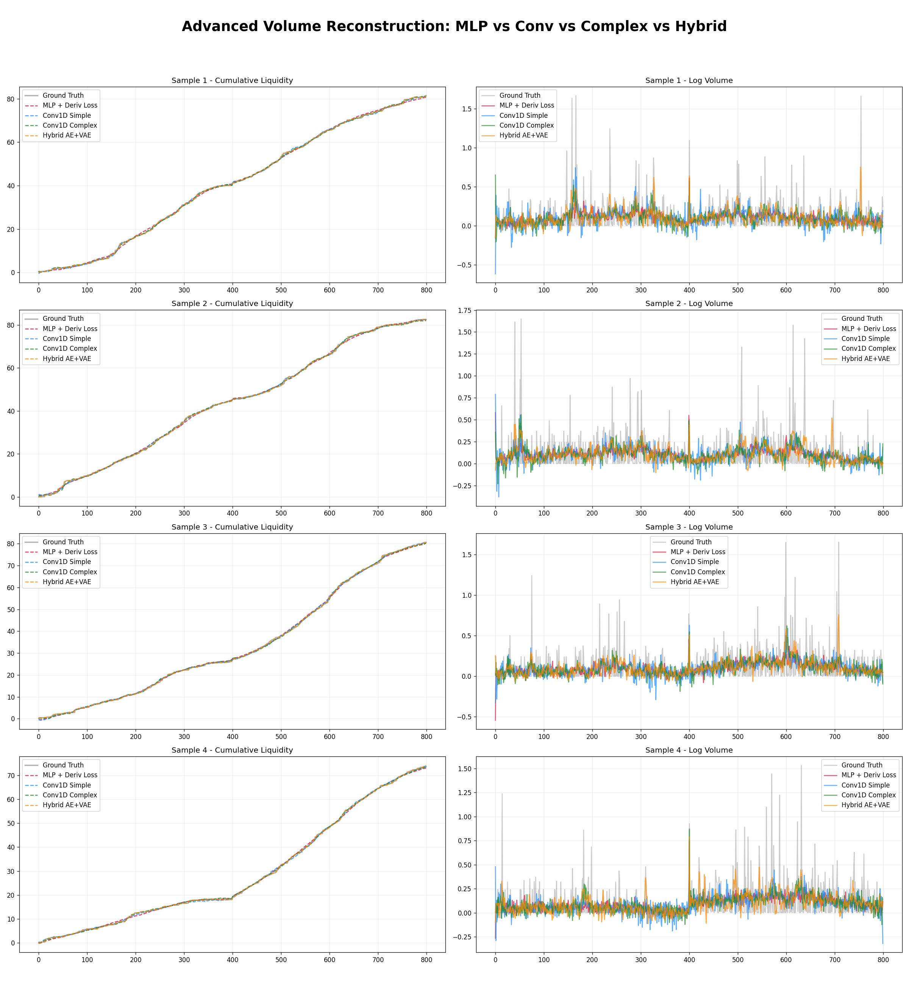
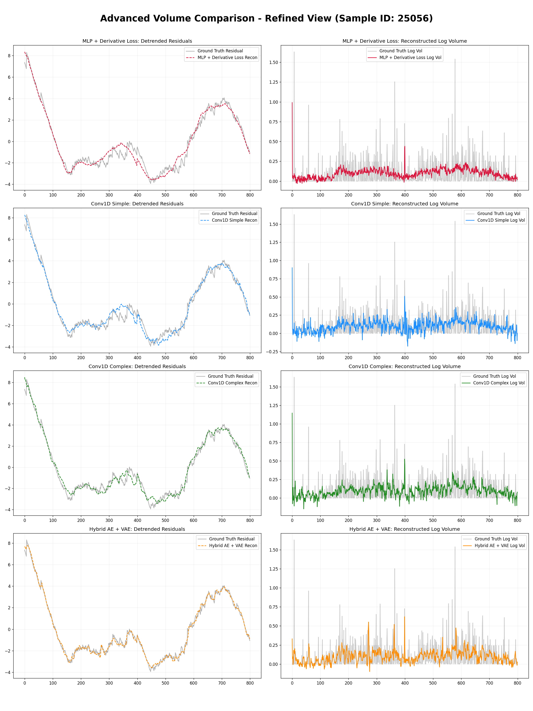
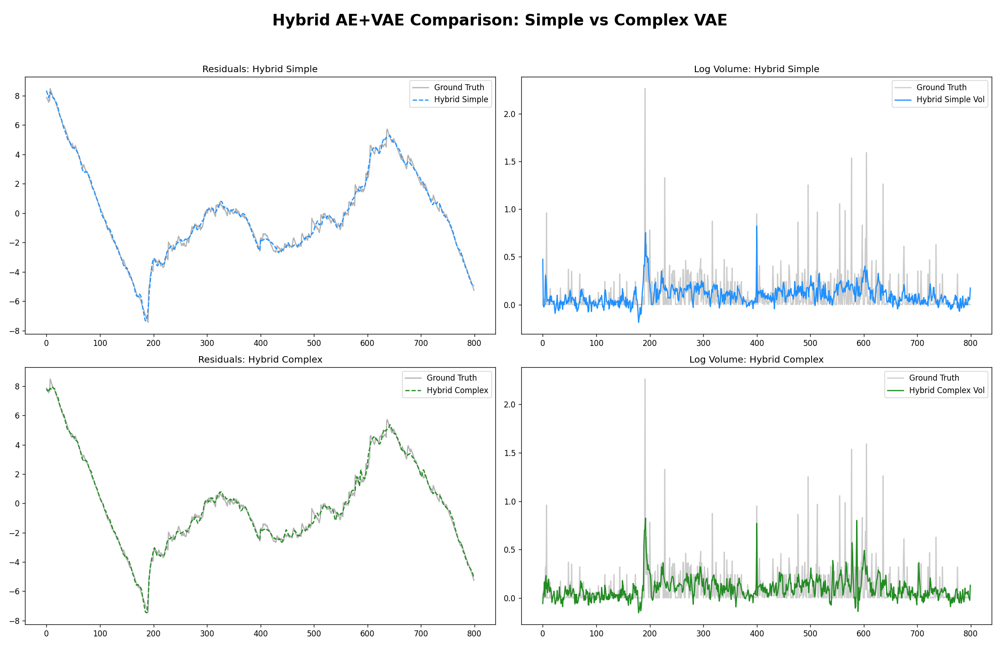
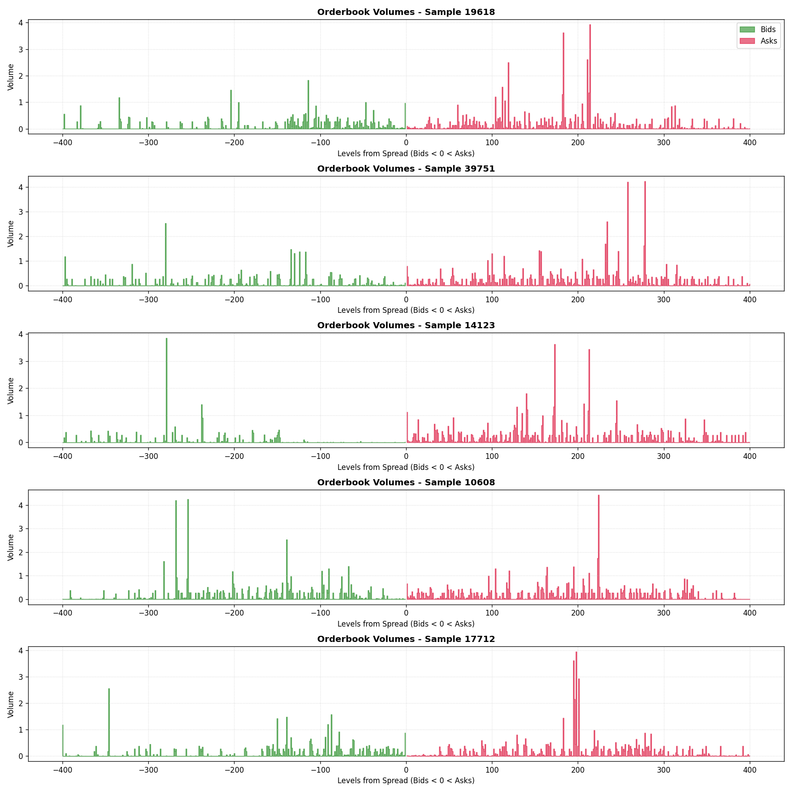
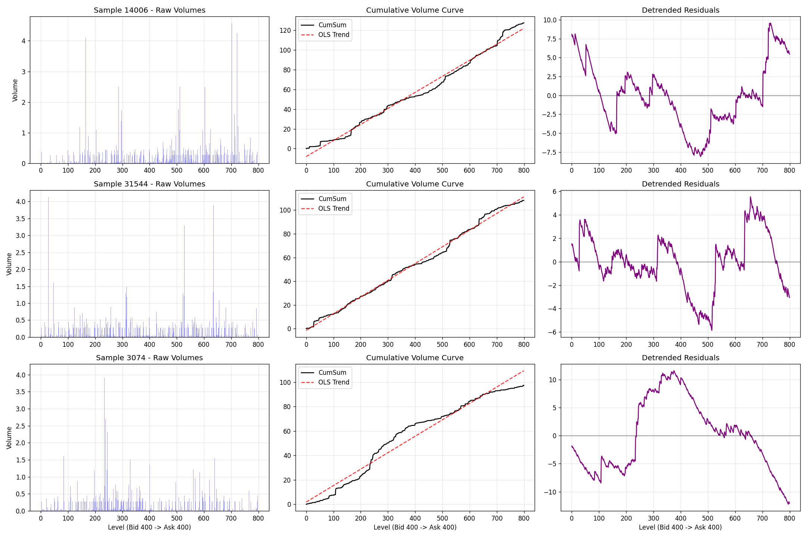
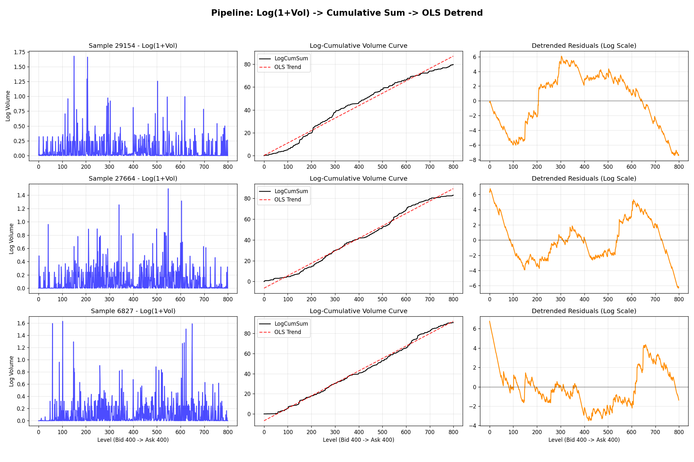

### 2.8 Таблица метрик по объемам
Источник: `experiments/volumes/12_benchmark_all_models/results/benchmark_table.md`

| Model            |   RMSE (Res) |   MAE (Res) |   RMSE (Vol) |   Spearman (Vol) |   Max Error |
|:-----------------|-------------:|------------:|-------------:|-----------------:|------------:|
| Base MLP         |       0.4024 |      0.3072 |       0.1802 |           0.308  |      2.5852 |
| MLP + Deriv Loss |       0.5281 |      0.4037 |       0.182  |           0.2963 |      2.7889 |
| Conv1D Simple    |       0.4022 |      0.3088 |       0.1954 |           0.2067 |      3.7278 |
| Conv1D Complex   |       0.3666 |      0.2799 |       0.1875 |           0.2427 |      2.8961 |
| Hybrid Simple    |       0.1821 |      0.1354 |       0.1669 |           0.3618 |      1.9494 |
| Hybrid Complex   |       0.1629 |      0.1207 |       0.1589 |           0.3887 |      1.8864 |
| Meta-Ensemble    |       0.2689 |      0.2035 |       0.1758 |           0.3251 |      2.3883 |

## 3. Эксперименты по ценам
### 3.1 Базовый MLP VAE
- Скрипт: `experiments/prices/01_price_mlp/train_price.py`
- Графики:
  - `experiments/prices/01_price_mlp/plots/price_training_curves.png`
  - `experiments/prices/01_price_mlp/plots/price_reconstructions.png`

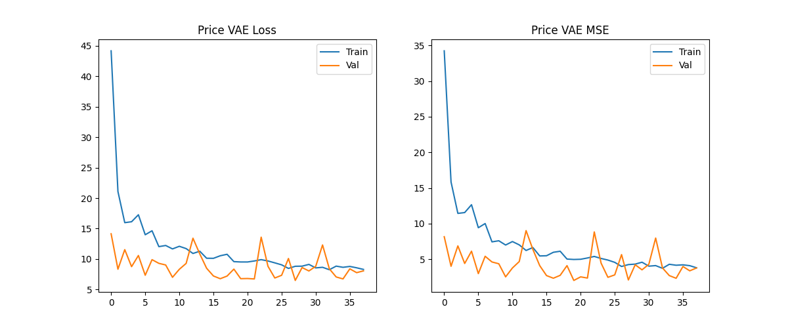
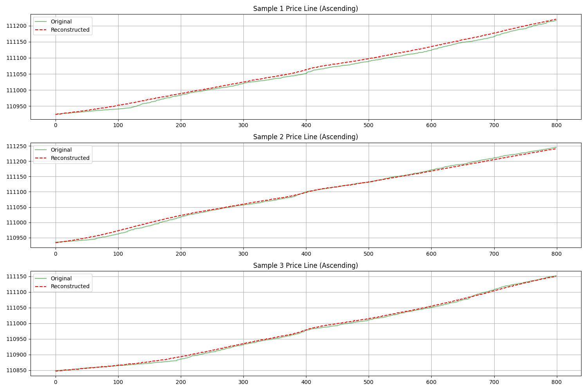

### 3.2 Детрендинг цен
- Скрипты: `experiments/prices/02_price_detrended_vae/train_detrended.py`, `visualize_detrended.py`
- Графики:
  - `experiments/prices/02_price_detrended_vae/plots/detrended_recon_ols.png`
  - `experiments/prices/02_price_detrended_vae/plots/detrended_recon_endpoints.png`

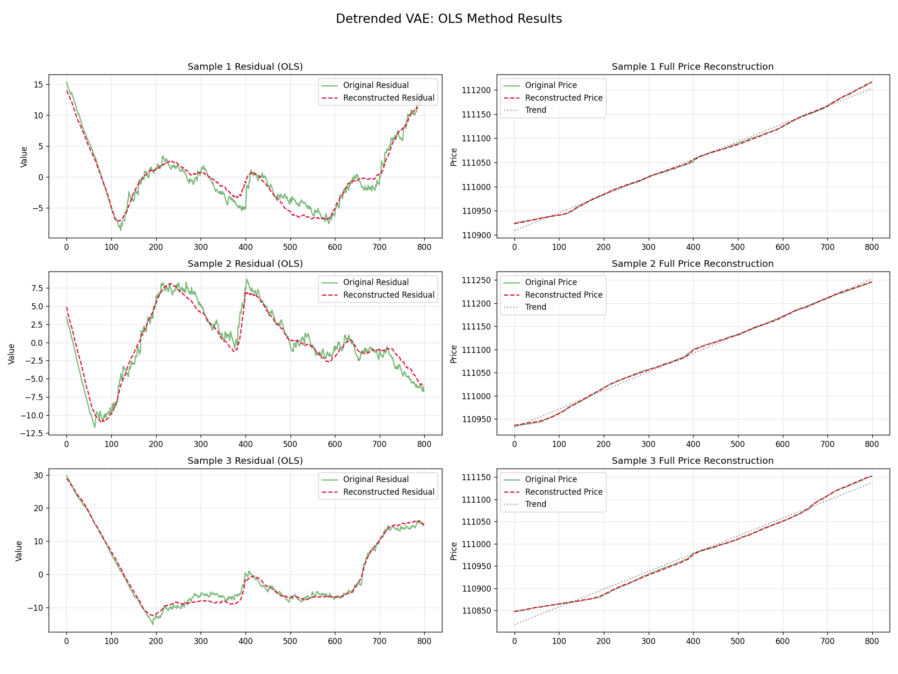
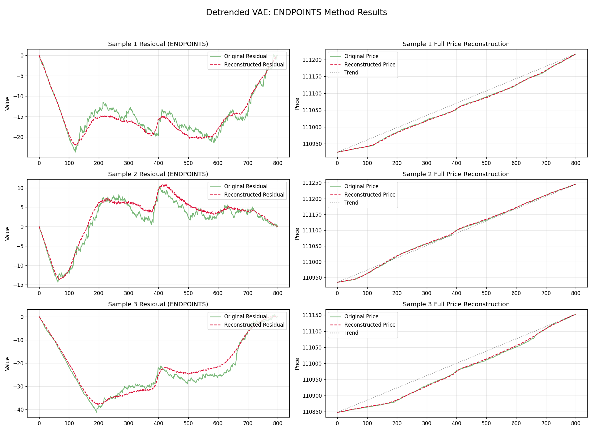

### 3.3 Conv1D vs MLP
- Скрипты: `experiments/prices/03_price_conv/train_price_conv.py`, `compare_price_conv.py`
- График: `experiments/prices/03_price_conv/plots/price_conv_comparison.png`

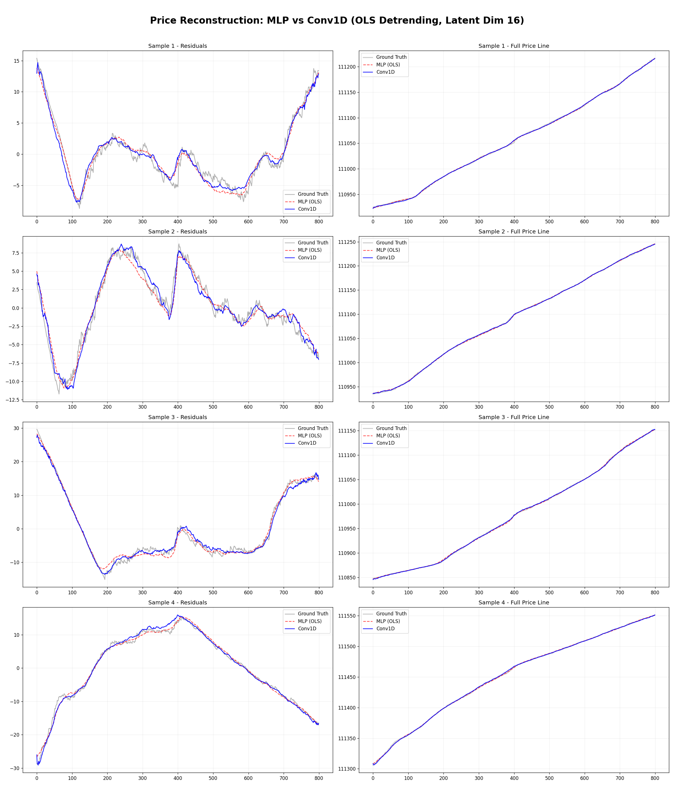

### 3.4 Ultra-Conv
- Скрипты: `experiments/prices/04_price_conv_ultra/train_price_conv_ultra.py`, `compare_price_ultra.py`
- График: `experiments/prices/04_price_conv_ultra/plots/price_ultra_fidelity.png`

### 3.5 Размерность латентного пространства (OLS)
- Скрипты: `experiments/prices/06_detrended_latent_dim/experiment_detrended.py`, `visualize_experiment_detrended.py`
- График: `experiments/prices/06_detrended_latent_dim/plots/ols_dim_comparison.png`

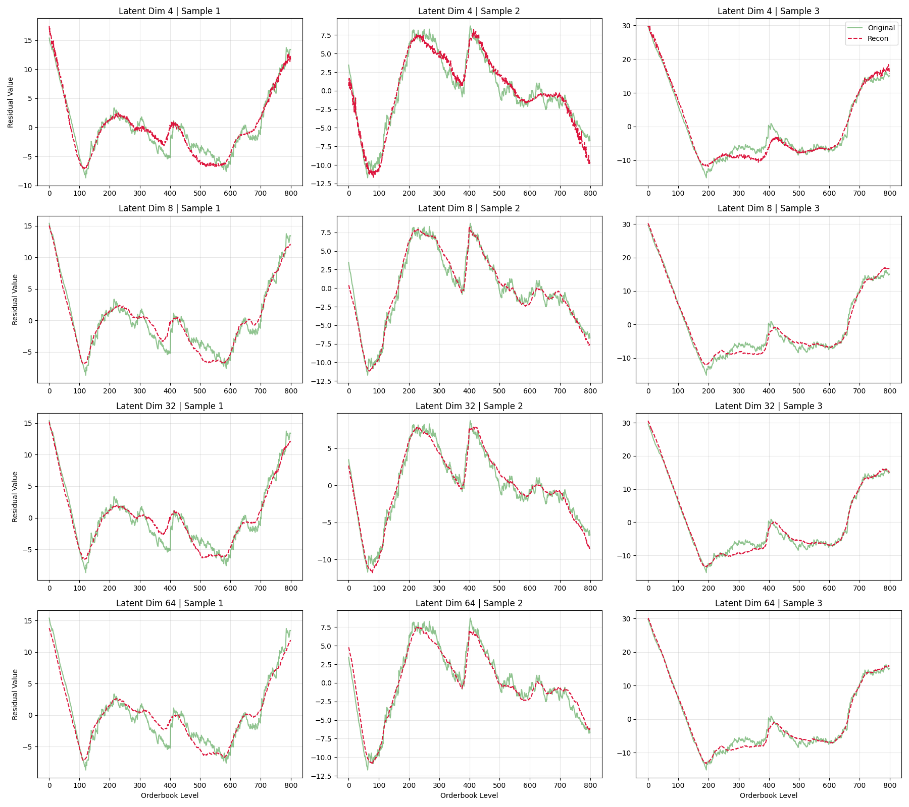

### 3.6 Таблица метрик по ценам
Источник: `experiments/prices/05_price_benchmark/results/price_benchmark_table.md`

| Model             |     RMSE |      MAE |       R² |   Max Error |
|:------------------|---------:|---------:|---------:|------------:|
| Base MLP          | 9.19883  | 7.11181  | 0.987445 |    45.2188  |
| MLP + OLS Detrend | 0.848342 | 0.635798 | 0.999892 |     9.67253 |
| Conv1D (4L)       | 0.831624 | 0.623144 | 0.999896 |     8.86048 |
| Ultra-Conv (5L)   | 0.755769 | 0.563172 | 0.999914 |     9.83267 |

## 4. Сводка артефактов
- Модели и скейлеры разложены по папкам экспериментов `experiments/volumes/*/models` и `experiments/prices/*/models`.
- Графики хранятся в `plots/` внутри каждого эксперимента.
- Таблицы метрик: `experiments/volumes/12_benchmark_all_models/results/benchmark_table.md` и `experiments/prices/05_price_benchmark/results/price_benchmark_table.md`.
