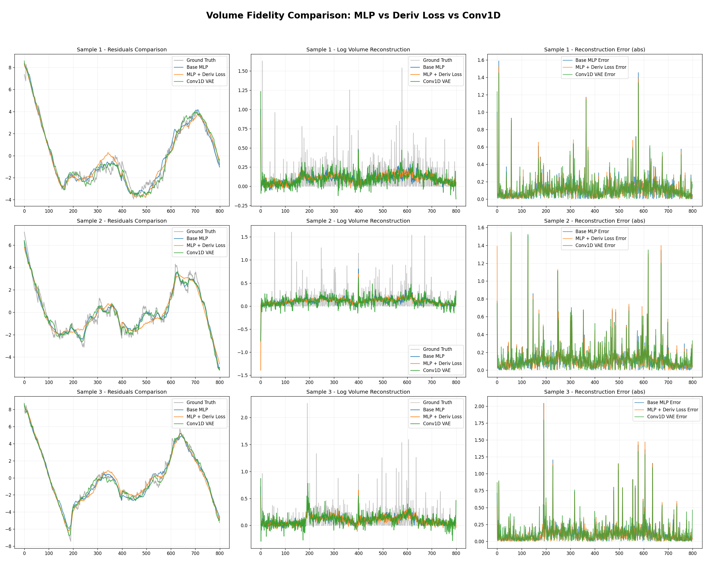
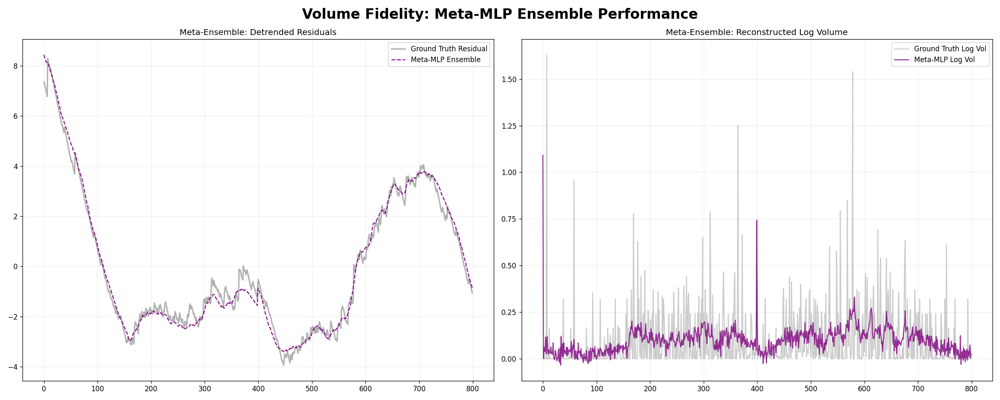
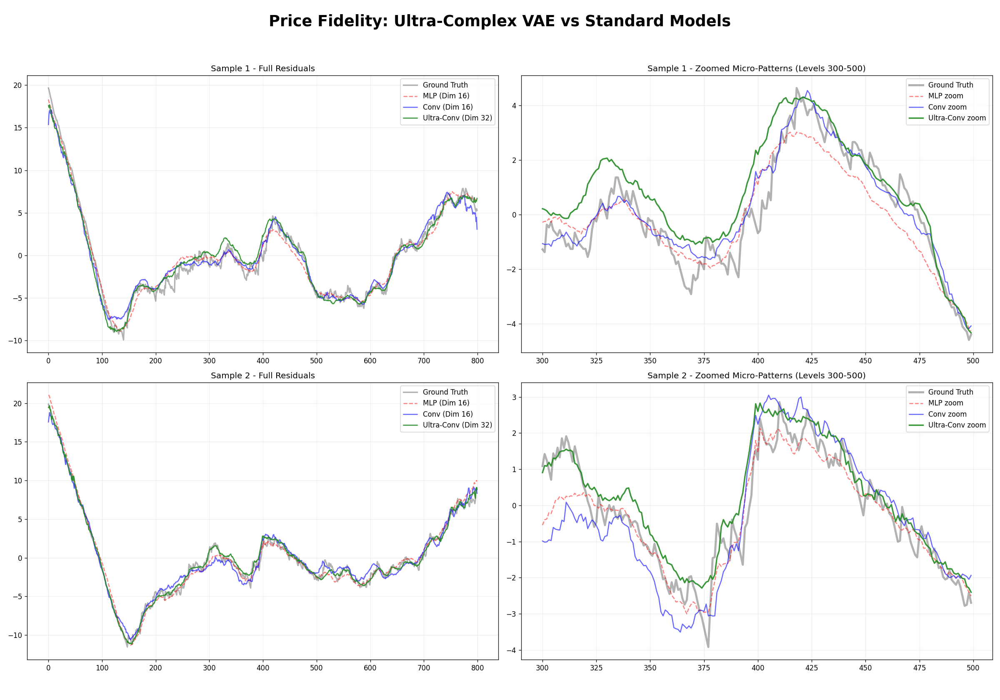

# Отчет об исследовании: Реконструкция состояний ордербука с использованием VAE

## 1. Введение и постановка задачи
Целью данного исследования является разработка и сравнение методов сжатия и генерации состояний стакана (Limit Order Book) криптовалютных пар (BTC/USDT) с использованием вариационных автоэнкодеров (VAE).

Задача разбивается на два независимых подпотока:
1.  **Моделирование профиля объемов (Volume Profile):** Реконструкция распределения ликвидности по ценовым уровням.
2.  **Моделирование ценовых линий (Price Lines):** Реконструкция абсолютных значений цен для уровней стакана (bids и asks).

Основная сложность заключается в высокой размерности данных (800 уровней), разреженности объемов и нестационарности цен.

---

## 2. Данные и предобработка

### 2.1 Источник данных
В качестве исходных данных используется снапшот L2-ордербука BTC/USDT глубиной 400 уровней в каждую сторону.
-   **Файл:** `data/BTC-USDT-L2orderbook-400lv-2025-08-28.parquet`
-   **Размерность:** `(N, 2, 400, 2)`, где каналы соответствуют `(side, level, feature)`.
    -   `side`: 0 - Bids, 1 - Asks.
    -   `feature`: 0 - Price, 1 - Amount.

### 2.2 Подготовка (Volume Pipeline)
Сырые объемы на уровнях являются крайне шумными и разреженными. Для улучшения обучаемости применялось преобразование в **лог-кумулятивную кривую**:
1.  **Объединение сторон:** Bids (инвертированные, от дальних к лучшим) и Asks (от лучших к дальним) конкатенируются в единый вектор длиной 800.
2.  **Log-transform:** Применяется `log1p(x)` для сглаживания экстремальных выбросов объема.
3.  **Cumulative Sum:** Вычисляется кумулятивная сумма логарифмов. Это превращает стохастический "шум" объемов в гладкую монотонно возрастающую функцию.
4.  **Detrending (OLS):** Из полученной кривой вычитается линейный тренд (методом наименьших квадратов). VAE учится восстанавливать только *нелинейные отклонения* (остатки) от тренда.

### 2.3 Подготовка (Price Pipeline)
Абсолютные цены нестационарны. Для их моделирования использовался детрендинг:
1.  **Формирование линии:** Аналогично объемам, цены bids и asks выстраиваются в единую линию (bids убывают, asks возрастают, но в векторе они упорядочены от дальнего bid к дальнему ask).
2.  **Detrending:**
    -   *OLS Method:* Вычитание линейной регрессии.
    -   *Endpoints Method:* Вычитание линии, проходящей через первую и последнюю точки. Гарантирует нулевые значения на краях.

---

## 3. Эксперименты: Моделирование объемов

Мы провели серию экспериментов, усложняя архитектуру и методы обучения.

### 3.1 Базовый подход (MLP + Log-Cumsum)
-   **Описание:** Полносвязный VAE (MLP) с латентной размерностью 32. Обучается на детрендированных лог-кумулятивных кривых.
-   **Результат:** Хорошо восстанавливает общую форму ("горб" ликвидности), но теряет локальные детали (микро-ступеньки).

### 3.2 Derivative Loss
-   **Гипотеза:** Стандартная MSE loss игнорирует локальные перепады. Добавление штрафа за ошибку первой производной заставит модель лучше учить форму.
-   **Реализация:** Loss = MSE(Recon, Target) + $\lambda$ * MSE(Diff(Recon), Diff(Target)).
-   **Наблюдение:** Модель стала лучше улавливать резкие изменения тренда, но общий уровень шума в метриках немного вырос.

### 3.3 Сверточные архитектуры (Conv1D)
-   **Conv1D Simple:** 4 слоя сверток.
-   **Conv1D Complex:** Более глубокая сеть с различными размерами ядер.
-   **Результат:** Сверточные сети лучше работают с локальной структурой данных, но иногда склонны к "размыванию" резких пиков из-за пулинга или страйдов.

### 3.4 Гибридный подход (AE + VAE) - **SOTA**
-   **Идея:** Разделить задачу на "грубую" и "точную" реконструкцию.
-   **Архитектура:**
    1.  Обучается обычный Autoencoder (AE) для сжатия данных.
    2.  Вычисляются остатки реконструкции AE: $Residual = X - AE(X)$.
    3.  Обучается VAE на этих остатках.
-   **Итог:** Финальная реконструкция $X_{recon} = AE(X) + VAE_{recon}(Residual)$.
-   **Результат:** Лучшие показатели среди всех одиночных моделей. AE берет на себя основную форму, VAE добавляет недостающую детализацию.

### 3.5 Мета-ансамбль (Meta-Ensemble)
-   **Идея:** Объединить предсказания всех предыдущих моделей (MLP, Conv, Hybrid, Derivative).
-   **Реализация:** Мета-модель (MLP) принимает на вход конкатенацию реконструкций от 5 разных моделей и учится предсказывать истинное значение.
-   **Результат:** Значительное снижение дисперсии ошибки. Ансамбль "сглаживает" индивидуальные артефакты моделей.

### Сводная таблица результатов (Volumes)
| Model | RMSE (Vol) | Spearman Corr | Описание |
|:---|---:|---:|:---|
| **Hybrid Complex** | **0.1589** | **0.3887** | Лучшая одиночная модель |
| Hybrid Simple | 0.1669 | 0.3618 | Хороший баланс скорости/качества |
| Meta-Ensemble | 0.1758 | 0.3251 | Устойчивый результат |
| Conv1D Complex | 0.1875 | 0.2427 | |
| Base MLP | 0.1802 | 0.3080 | Базовый бейзлайн |

*(Метрики RMSE (Vol) рассчитаны на восстановленных объемах после обратного преобразования)*

---

## 4. Эксперименты: Моделирование цен

### 4.1 Влияние метода детрендинга
Сравнение методов OLS (Method of Least Squares) и Endpoints (соединение концов) показало:
-   **OLS:** Дает меньшую среднеквадратичную ошибку по всему диапазону.
-   **Endpoints:** Жестко фиксирует края в 0, что полезно для сохранения целостности "спреда" при реконструкции, но дает большую ошибку в середине.

### 4.2 Архитектуры: MLP vs Conv1D vs Ultra-Conv
-   **MLP:** Быстро учится, но плохо масштабируется на длинные последовательности.
-   **Conv1D:** Стандартная архитектура показала значительный прирост качества ($R^2 \approx 0.9999$).
-   **Ultra-Conv:** Глубокая 5-слойная сверточная сеть с малыми ядрами (kernel=3). Создана для захвата микроструктуры цены.

### Результаты (Prices)
| Model | RMSE | $R^2$ | Max Error |
|:---|---:|---:|---:|
| **Ultra-Conv (5L)** | **0.7558** | **0.9999** | **9.83** |
| Conv1D (4L) | 0.8316 | 0.9999 | 8.86 |
| MLP + OLS | 0.8483 | 0.9999 | 9.67 |
| Base MLP (No Detrend) | 9.1988 | 0.9874 | 45.22 |

**Вывод:** Глубокие сверточные сети (Ultra-Conv) в сочетании с OLS-детрендингом обеспечивают наивысшую точность восстановления ценовых кривых.

---

## 5. Визуализация результатов

### Объемы (Volumes)
#### Сравнение точности (Fidelity)
Ниже представлено сравнение качества восстановления профиля объемов разными моделями. Видно, что **Hybrid** подходы (зеленые линии) наиболее точно повторяют профиль оригинала.

#### Мета-ансамбль
Демонстрация того, как ансамбль усредняет входы.

### Цены (Prices)
#### Реконструкция (Ultra-Conv)
Восстановление детрендированной кривой цен. Модель часто улавливает даже мелкие колебания, но иногда ведет себя странно.

---

## 6. Заключение
В ходе исследования мы выяснили:
1.  **Препроцессинг критичен:** Переход к лог-кумулятивным объемам и детрендинг цен являются обязательными шагами для стабильного обучения VAE на данных ордербука.
2.  **Гибридные архитектуры доминируют:** Комбинация детерминированного сжатия (Autoencoder) и стохастического моделирования остатков (VAE) дает наилучшие результаты для объемов.
3.  **Свертки для цен:** Для ценовых рядов глубокие сверточные сети (Ultra-Conv) превосходят MLP за счет учета локальных зависимостей.
4.  **Ансамблирование:** Позволяет сгладить ошибки отдельных моделей, но требует больших вычислительных затрат. В продакшене `Hybrid Complex` может быть предпочтительнее как более легкая альтернатива.

Все скрипты, модели и инструкции по воспроизведению находятся в соответствующих папках `experiments/`.
